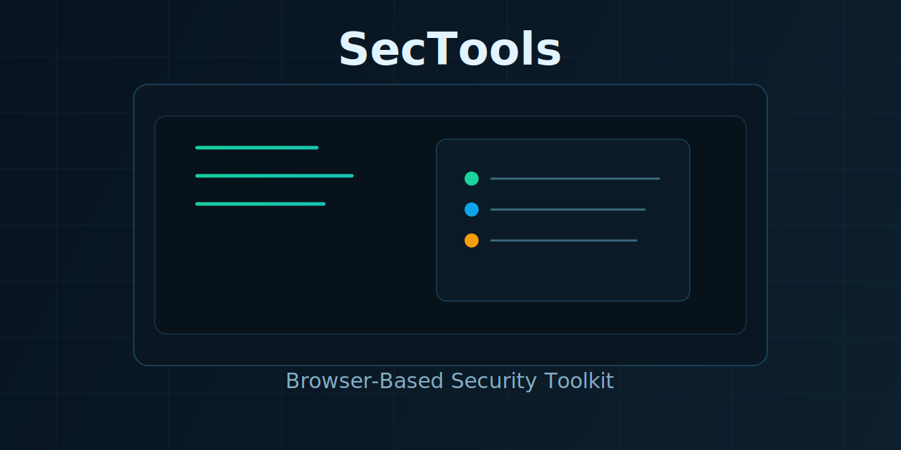

# SecTools

<p align="center">
  
</p>

<p align="center">
  <b>Portable browser-based security toolkit</b><br/>
  <sub>Next.js + FastAPI, focused on practical offensive and defensive workflows</sub>
</p>

<p align="center">
  
  
  
  
  
  
</p>

## Overview

SecTools is a local-first web application that combines common red-team and blue-team utilities in one UI.
The frontend runs in your browser and calls a local FastAPI backend on `127.0.0.1:8000`.

## Feature Set

### Core Modules

- Port scanner with service mapping
- Crypto helper (hashing, encryption/decryption, HMAC, password generator, JWT decode, RSA keypair)
- IP intelligence (geolocation, reverse DNS, WHOIS, DNS lookup, subnet calculator)
- Reverse shell payload generator
- Bookmarks and operation history

### Web Toolkit (Extended)

- HTTP Request Tester
- URL Parser
- Timestamp Converter
- File Hasher (browser-local)
- IOC Extractor
- HTTP Security Header Audit
- JWT Inspector Pro
- Secret Scanner
- TLS Certificate Analyzer

## Tech Stack

- Frontend: Next.js 14, React 18, TypeScript, Tailwind CSS, Radix UI
- Backend: FastAPI, Uvicorn, Pydantic
- Security/Networking libs: `cryptography`, `dnspython`, `python-whois`, `geoip2`, `pyjwt`, `bcrypt`

## Quick Start

### Prerequisites

- Node.js 18+
- Python 3.11+

### Install

```bash
npm install
cd python_backend
py -m pip install -r requirements.txt
cd ..
```

If `py` is unavailable, use `python3`.

### Windows (recommended bootstrap)

```cmd
scripts\setup-windows.cmd
```

## Run (Development)

Terminal 1:

```bash
scripts/run-backend.cmd
```

Terminal 2:

```bash
npm run dev
```

Open:

```text
http://localhost:3000
```

## Build

```bash
npm run build
```

## Project Layout

```text
sectools/
|- src/                  # Next.js frontend
|- python_backend/       # FastAPI backend
|- scripts/              # helper scripts
|- QUICKSTART.md
|- PROJECT_SUMMARY.md
`- README.md
```

## Operational Notes

- Project is web-only (desktop wrappers removed).
- Backend restart is manual in browser mode.
- If port `8000` is busy, stop the existing process before starting backend.

## Troubleshooting

### Backend does not start (`WinError 10048`)

```cmd
netstat -ano | findstr :8000
taskkill /PID <PID> /F
```

Then rerun `scripts/run-backend.cmd`.

### Missing Python packages in custom Python install

Use your active environment and install directly:

```bash
py -m pip install -r python_backend/requirements.txt
```

### Frontend says backend is checking forever

- Confirm backend health endpoint:

```text
http://127.0.0.1:8000/health
```

- Restart backend if health fails.

## Security Disclaimer

Use SecTools only in environments you own or are explicitly authorized to test.
The project is intended for legitimate security testing, learning, and defense.
